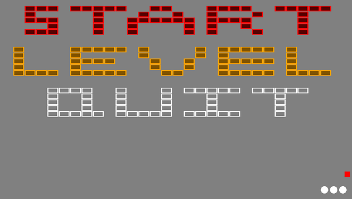
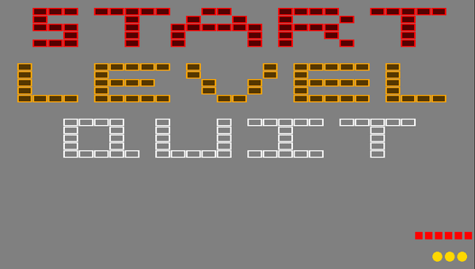
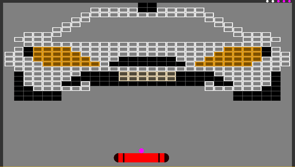

# VitOut

## How to play:
Try to destroy all the bricks as fast as possible and with the least lives lost.

Bricks with darker core need 2-6 hits to be destoyed
Bricks with one solid color dissapear with one hit

In the level selector is the highscore per level visible (in the gif example lvl 6 has 3 golden balls and lvl 5 has no score yet)

## Screenshots
 
- <kbd>Cross</kbd> or <kbd>Start</kbd> - Start the game
- <kbd>Dpad Up</kbd> or <kbd>Dpad Down</kbd> - Change selection

 
- <kbd>Dpad Left</kbd> or <kbd>Dpad Right</kbd> - Change Level
- <kbd>Dpad Up</kbd> or <kbd>Dpad Down</kbd> - Change selection

 
- <kbd>Left Joystick</kbd> - Move Paddle
- <kbd>Cross</kbd> - Release ball
- <kbd>Start</kbd> - Pause

## Known Bugs

- Tell me!

## Special Thanks to:

Vitadev Package manager for releasing the SDK \
I would like to thank the developers of Vita3K to help me create my content at a faster pace.
