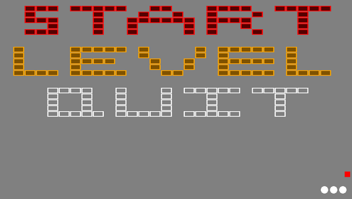
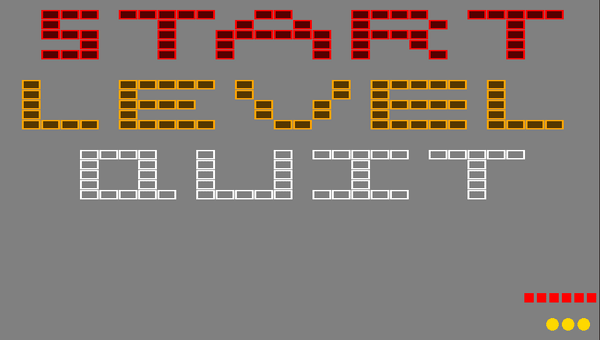
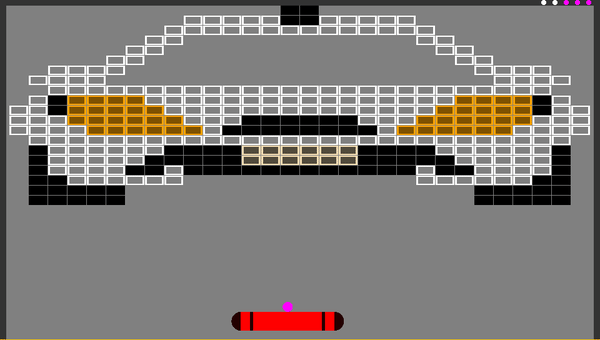

# VitOut

[](https://github.com/Dane64/VitOut/releases)
[](https://github.com/Dane64/VitOut/releases/latest)

## How to play:
Try to destroy all the bricks as fast as possible and with the least lives lost.

Bricks with darker core need 2-6 hits to be destoyed \
Bricks with one solid color dissapear with one hit

In the level selector is the highscore per level visible (in the gif example lvl 6 has 3 golden balls and lvl 5 has no score yet)

## Screenshots
<br>
- <kbd>Cross</kbd> or <kbd>Start</kbd> - Start the game
- <kbd>Dpad Up</kbd> or <kbd>Dpad Down</kbd> - Change selection

<br>
- <kbd>Dpad Left</kbd> or <kbd>Dpad Right</kbd> - Change Level
- <kbd>Dpad Up</kbd> or <kbd>Dpad Down</kbd> - Change selection

<br>
- <kbd>Left Joystick</kbd> - Move Paddle
- <kbd>Cross</kbd> - Release ball
- <kbd>Start</kbd> - Pause

## Known Bugs

- Tell me!

## Building

The builder follows `ubuntu:latest`, current Ubuntu build-tool packages, and the
newest supported VitaSDK release series for the existing Vita ABI. VitaSDK's
upstream bootstrap verifies signed channel metadata and installs matching
compiler and library packages. No image digests, package versions, or dependency
checksums are pinned in this repository. Only `libvita2d` and its dependencies
are installed, rather than compiling the SDK or installing every VitaSDK package.
The container targets `linux/amd64`.

Build the image, then compile and package the game:

```sh
docker buildx build --pull --platform linux/amd64 \
  --no-cache-filter package-index,sdk-index \
  --load --tag vitout-builder .
mkdir -p build dist .cache/ccache
docker run --rm --network none \
  --user "$(id -u):$(id -g)" \
  --volume "$PWD:/src:ro" \
  --volume "$PWD/build:/build" \
  --volume "$PWD/dist:/out" \
  --volume "$PWD/.cache/ccache:/ccache" \
  vitout-builder
```

The output is `dist/VitOut.vpk` and `dist/SHA256SUMS`. Builds without a release
tag retain the version declared in `CMakeLists.txt`. To build a release locally
without publishing it, add `--env RELEASE_TAG=v2.1` before the image name; this
produces `VitOut-2.1.vpk` with Vita package version `02.01`.

Keep the mounted build and compiler-cache directories for incremental local
builds. Run the image-build command again to pick up upstream updates. `--pull`
refreshes the base image; `--no-cache-filter` refreshes the package and SDK metadata
probes without discarding unchanged installation layers. Keep both options when
building locally so cached layers cannot indefinitely hide dependency updates.
Checksum files are ignored by Git; generated release checksums are still included
in workflow artifacts and GitHub Releases.

## CI and releases

Every branch push and pull request runs the same containerized Release build
used for publishing, including VPK archive integrity checks. Branch builds are
available as the `VitOut-vpk` workflow artifact for seven days; they never create
a GitHub Release or derive a version from the branch name. CI can also be run
manually from the Actions tab.

The shared workflow caches builder-image layers with BuildKit and compiler
results with ccache. Dependency metadata is refreshed on every run, while
installation layers are reused when the resolved versions have not changed.
Source and artwork changes do not invalidate those layers. Compiler-cache keys
include the installed toolchain versions and source inputs, so unchanged
translation units can be reused across commits, subject to GitHub's branch cache
visibility. CI uses a fresh build directory and always packages the current
artwork and metadata instead of restoring a potentially stale VPK. Superseded
branch runs are cancelled; release runs are not.

Runners use `ubuntu-latest`, and actions follow their upstream `main` or `master`
branches rather than fixed commits. Upstream changes are therefore adopted
automatically; builds of an older source commit can change as dependencies evolve.

To publish a release, commit and push the release-ready branch, then push a new
tag on that commit:

```sh
git push origin HEAD
git tag -a v2.1 -m "VitOut 2.1"
git push origin v2.1
```

Tags use `[v]MAJOR.MINOR[-PRERELEASE]`, with each number between 0 and 99 and no
leading zeros. The optional `v` preserves compatibility with existing tags.
For example, `v2.1` and `2.1` both produce Vita version `02.01`; `v2.2-rc.1`
produces `02.02` and is marked as a GitHub prerelease. Vita's version field is
limited to `NN.NN`, so three-component tags such as `v2.1.3` are rejected rather
than silently discarding a patch version.

After the tagged build succeeds, the release workflow publishes the versioned
VPK and `SHA256SUMS` with generated release notes. Only the publishing job has
repository write permission, and it uses the built artifact without rebuilding.
No registry credentials or personal access token are required. Existing releases
are not overwritten; use a new version tag for a new release.

## Special Thanks to:

Vitadev Package manager for releasing the SDK \
I would like to thank the developers of Vita3K to help me create my content at a faster pace.
